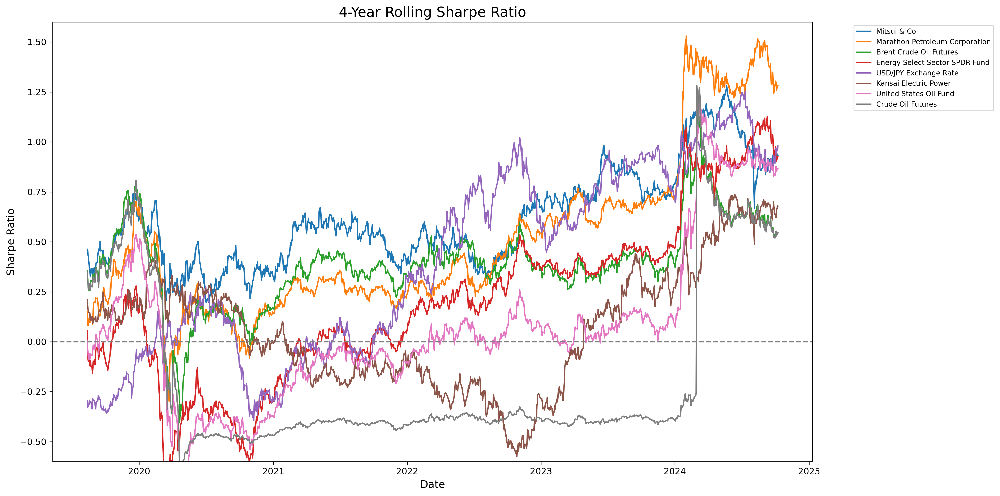
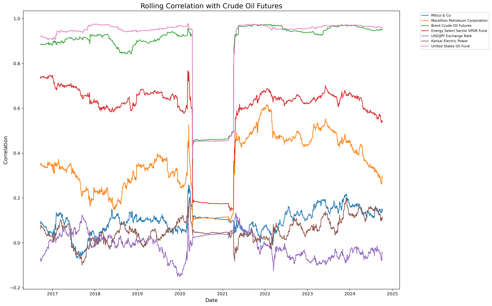

# 石油関連企業の財務分析レポート

## ディレクトリ構成

```
.
├── src/
│   ├── stats.py
│   └── yf.py
├── data/
│   └── oil.csv
└── output/
    ├── 4-year_rolling_annual_returns.png
    ├── 4-year_rolling_sharpe_ratio.png
    ├── correlation_heatmap.png
    ├── rolling_correlation_with_crude_oil_futures.png
    └── stock_selection_oil_correlation_vs_sharpe_ratio.png
```

## 概要

このプロジェクトは、石油関連企業の財務パフォーマンスを分析し、業界全体のトレンドを把握することを目的としています。`src/yf.py`を使用してデータを取得し、`src/stats.py`で分析を行っています。

## 主な発見と金融的知見

### 1. リスク調整後リターン（シャープレシオ）の重要性



- シャープレシオは、リスク調整後のリターンを示す重要な指標です。
- 三井物産の高いシャープレシオ（0.696）は、効率的なリスク管理と収益性の高さを示唆しています。
- 投資家は単純なリターンだけでなく、このようなリスク調整後の指標を重視すべきです。

### 2. 分散投資の重要性


- 相関ヒートマップは、分散投資の機会を示しています。
- 例えば、石油関連企業と電力会社の間の相関が比較的低いことは、セクター間での分散投資の有効性を示唆しています。
- 分散投資は、ポートフォリオ全体のリスクを低減するために重要な戦略です。

### 3. マクロ経済要因の影響


- USD/JPY為替レートの変動は、多くの企業のパフォーマンスに影響を与えています。
- 為替リスクは国際的に事業を展開する企業にとって重要な考慮事項です。
- 投資家は、個別企業の分析だけでなく、マクロ経済要因にも注目する必要があります。

### 4. セクター特性の理解

- 電力会社の安定したリターンは、規制産業の特性を反映しています。
- 一方、商社の高いボラティリティは、より市場変動の影響を受けやすいビジネスモデルを示しています。
- セクター特性の理解は、適切な投資戦略の策定に不可欠です。

### 5. 長期的視点の重要性

- 4年間のローリング指標を使用することで、短期的な変動を平滑化し、長期的なトレンドを把握できます。
- 長期投資家は、このような長期的な視点でパフォーマンスを評価することが重要です。

### 6. システマティックリスクとアンシステマティックリスク

- 相関ヒートマップは、システマティックリスク（市場全体に影響を与えるリスク）とアンシステマティックリスク（個別企業に特有のリスク）の違いを示しています。
- 分散投資は主にアンシステマティックリスクを低減するのに効果的ですが、システマティックリスクの管理には異なるアプローチが必要です。

### 7. 原油先物との相関分析



- この図は、各資産と原油先物の間のローリング相関を示しています。
- Brent原油先物とUnited States Oil Fundは、予想通り原油先物と非常に高い相関（0.8-1.0）を示しています。
- エネルギーセクターETF（Energy Select Sector SPDR Fund）も比較的高い相関（0.5-0.7）を維持しています。
- 一方、三井物産やMarathon Petroleum Corporationなどの個別企業は、原油価格との相関が時期によって大きく変動しています。これは、これらの企業が原油価格以外の要因にも影響を受けていることを示唆しています。
- USD/JPY為替レートは原油価格との相関が低く、ほぼゼロ付近を推移しています。これは、為替レートが原油価格とは独立した要因で動いていることを示しています。

### 8. 株式選択：原油相関とシャープレシオの関係


- この散布図は、各企業の原油価格との相関（X軸）とシャープレシオ（Y軸）の関係を示しています。色はボラティリティを表しています。
- 三井物産（Mitsui & Co）は、原油価格との相関が低い（約0.05）にもかかわらず、高いシャープレシオ（約0.7）を示しています。これは、三井物産が効果的にリスクを管理しながら、原油価格変動の影響を最小限に抑えていることを示唆しています。
- Marathon Petroleum Corporationは、中程度の原油価格相関（約0.15）と比較的高いシャープレシオ（約0.55）を示しています。これは、同社が原油価格変動のリスクをある程度受けながらも、効果的にリターンを生み出していることを示唆しています。
- Brent原油先物は、予想通り原油価格との相関が非常に高い（約0.45）ですが、シャープレシオは中程度（約0.35）です。これは、原油先物が高いリターンを提供する可能性がある一方で、高いリスクも伴うことを示しています。
- 電力会社（例：関西電力、Tokyo Electric Power）は、原油価格との相関が低く、シャープレシオも比較的低いです。これは、これらの企業が安定したキャッシュフローを持つ一方で、高成長の機会が限られていることを示唆しています。

## 結論

このプロジェクトは、金融データ分析の基本的なアプローチを示しています。リターン、リスク、相関などの基本的な指標を組み合わせることで、投資判断や経営戦略に有用な洞察を得ることができます。

特に、原油価格との相関とシャープレシオの関係を分析することで、以下のような洞察が得られました：

1. 三井物産のような企業は、原油価格変動の影響を最小限に抑えながら、効果的にリスク調整後リターンを生み出しています。これは、多角化されたビジネスモデルの強みを示唆しています。

2. Marathon Petroleum Corporationのような企業は、原油価格変動のリスクにさらされながらも、それを上回るリターンを生み出しています。これは、効果的なリスク管理と事業戦略の結果と考えられます。

3. 原油先物や関連ETFは、高いリターンの可能性がある一方で、高いリスクも伴います。これらの商品は、リスク許容度の高い投資家や、ポートフォリオの一部として慎重に使用する投資家に適しています。

4. 電力会社は、安定性を求める投資家にとって魅力的な選択肢となる可能性がありますが、高成長を期待することは難しいかもしれません。

これらの分析結果は、投資家が自身のリスク許容度と投資目標に合わせて、適切な資産配分を行う際の参考になります。ただし、過去のデータに基づく分析には限界があることを認識し、常に新しい情報と市場環境の変化に注意を払う必要があります。

また、このような分析は投資判断の一部に過ぎません。企業の財務諸表、経営戦略、業界動向、そして広範な経済・政治状況など、総合的な判断が求められます。